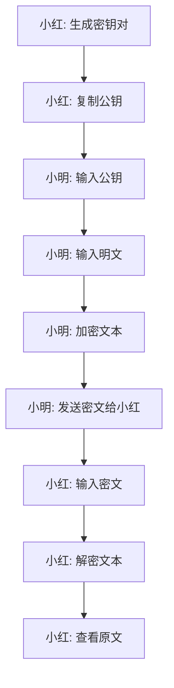

## 1. Product Overview
文本加密解密网页应用，使用公钥/私钥模式实现安全的文本传输
- 解决用户在不安全渠道（如微信、邮件）传输敏感信息的安全问题
- 目标用户为需要在日常通信中保护隐私的个人用户

## 2. Core Features

### 2.1 User Roles (if applicable)
| Role | Registration Method | Core Permissions |
|------|---------------------|------------------|
| User | 无需注册 | 使用加密/解密功能 |

### 2.2 Feature Module
1. **主页**: 密钥生成、公钥复制、文本加密、文本解密功能

### 2.3 Page Details
| Page Name | Module Name | Feature description |
|-----------|-------------|---------------------|
| 主页 | 密钥生成模块 | 生成一对公钥和私钥，私钥自动存储在本地 |
| 主页 | 加密模块 | 使用对方公钥对输入文本进行加密 |
| 主页 | 解密模块 | 使用本地私钥对输入密文进行解密 |
| 主页 | 复制功能 | 一键复制公钥或加密结果 |

## 3. Core Process
1. 接收方（小红）在网页上生成密钥对（公钥+私钥）
2. 小红的私钥存储在本地，公钥可以复制分享
3. 发送方（小明）使用小红的公钥加密文本
4. 小明将加密后的密文通过任何渠道发送给小红
5. 小红使用本地私钥解密密文，查看原文

## 4. User Interface Design
### 4.1 Design Style
- 主色调：深蓝色 (#1a365d) 和浅蓝色 (#4299e1)
- 辅助色：灰色 (#e2e8f0)，成功绿色 (#48bb78)
- 按钮风格：圆角矩形，轻微阴影
- 字体：无衬线字体，主标题 20px，正文 14px
- 布局风格：卡片式布局，清晰的分区
- 图标风格：简约线条图标

### 4.2 Page Design Overview
| Page Name | Module Name | UI Elements |
|-----------|-------------|-------------|
| 主页 | 密钥生成模块 | 居中的生成按钮，生成后显示公钥和私钥区域，私钥区域有复制按钮 |
| 主页 | 加密模块 | 输入框用于粘贴公钥，文本区域输入明文，加密按钮，结果显示区域带复制按钮 |
| 主页 | 解密模块 | 文本区域输入密文，解密按钮，结果显示区域 |
| 主页 | 整体布局 | 响应式设计，在移动端垂直排列，在桌面端左右分栏 |

### 4.3 Responsiveness
- 采用移动优先设计
- 桌面端：左右分栏布局，左侧密钥生成，右侧加密/解密
- 移动端：垂直堆叠布局，依次为密钥生成、加密、解密模块
- 触摸优化：按钮大小适合触摸操作

### 4.4 3D Scene Guidance (if applicable)
- 不适用