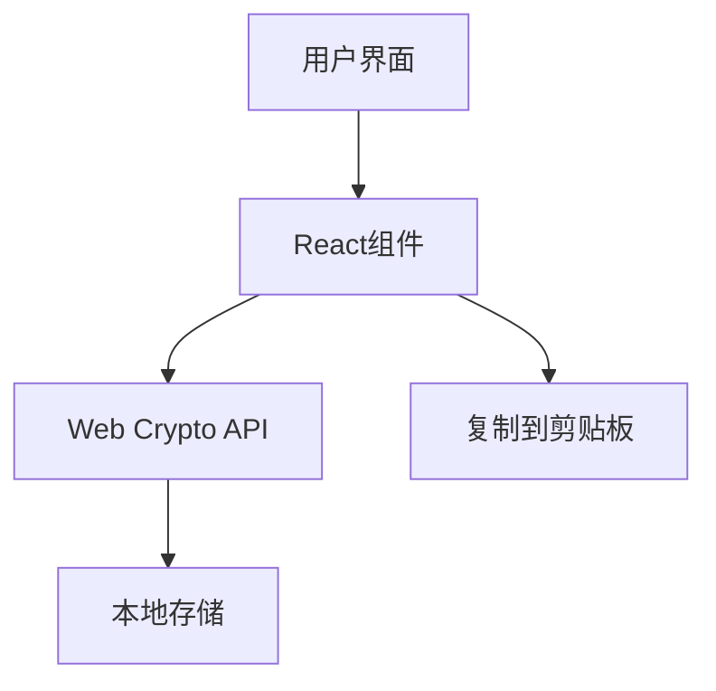

## 1. Architecture Design


## 2. Technology Description
- Frontend: React@18 + tailwindcss@3 + vite
- Initialization Tool: vite-init
- Backend: 无
- Database: 无（使用本地存储）
- 加密库：Web Crypto API（浏览器内置）

## 3. Route Definitions
| Route | Purpose |
|-------|---------|
| / | 主页，包含所有功能 |

## 4. API Definitions (if backend exists)
- 不适用

## 5. Server Architecture Diagram (if backend exists)
- 不适用

## 6. Data Model (if applicable)
- 不适用

## 7. 核心技术实现
### 7.1 密钥生成
- 使用Web Crypto API的`generateKey`方法生成RSA密钥对
- 密钥参数：RSA-OAEP算法，2048位密钥长度
- 私钥存储在本地，使用localStorage

### 7.2 加密过程
- 使用Web Crypto API的`encrypt`方法
- 输入：对方公钥（以PEM格式）和明文
- 输出：加密后的密文（Base64编码）

### 7.3 解密过程
- 使用Web Crypto API的`decrypt`方法
- 输入：本地私钥和密文（Base64编码）
- 输出：解密后的明文

### 7.4 复制功能
- 使用浏览器的`navigator.clipboard.writeText` API
- 复制后显示成功提示

### 7.5 响应式设计
- 使用Tailwind CSS的响应式类
- 断点设置：sm(640px), md(768px), lg(1024px)

## 8. 项目结构
```
/src
  /components
    /KeyGenerator.tsx        # 密钥生成组件
    /EncryptSection.tsx       # 加密模块组件
    /DecryptSection.tsx       # 解密模块组件
  /utils
    /crypto.ts               # 加密解密工具函数
    /storage.ts              # 本地存储工具函数
  /hooks
    /useCrypto.ts            # 加密相关的自定义Hook
  App.tsx                    # 主应用组件
  main.tsx                   # 应用入口
```